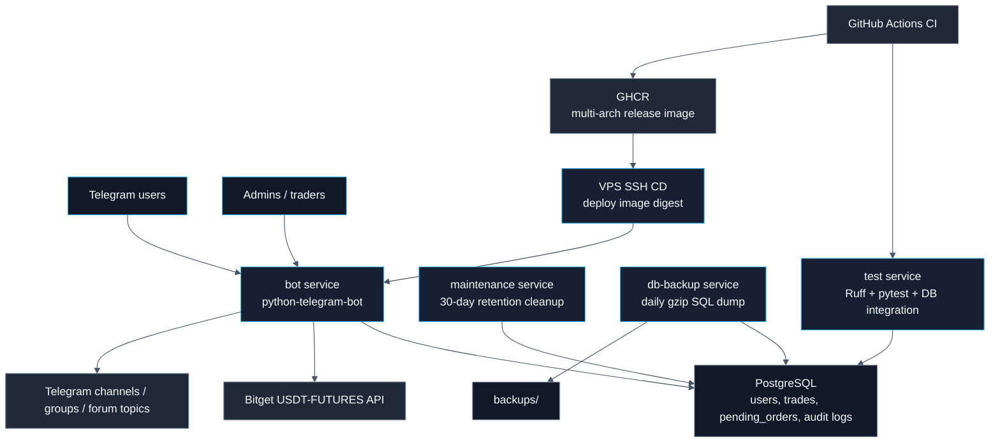
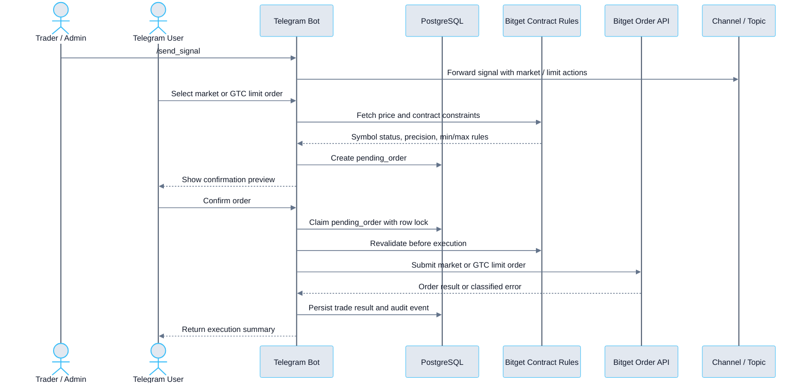

# Kaiyn Trading Bot

[](https://github.com/kylekkkk61/kaiyn-trading-bot/actions/workflows/ci.yml)
[](./LICENSE)
[](https://docs.astral.sh/uv/)
[](./compose.yml)
[](.github/workflows/release.yml)

[](./pyproject.toml)
[](./compose.yml)
[](https://python-telegram-bot.org/)
[](https://www.sqlalchemy.org/)
[](https://alembic.sqlalchemy.org/)
[](https://docs.astral.sh/ruff/)
[](https://docs.pytest.org/)
[](./.github/dependabot.yml)

> 🌐 [中文版 README](readme_zh.md)

Kaiyn Trading Bot is a Telegram-integrated trading signal execution bot for Bitget USDT-FUTURES. The project is designed to production-ready standards, covering order confirmation flows, exchange rule validation, encrypted credential storage, audit trails, backup and restore, and CI/CD.

Users can configure encrypted API credentials via Telegram, set a fixed 1R risk amount, and submit market or GTC limit orders from trading signal buttons.

> **Risk Disclaimer:** This project connects to live exchange APIs and submits real futures orders. Bitget API keys should be granted trading permissions only — do not grant withdrawal permissions.

## Highlights

- PostgreSQL-backed pending orders with row locking to prevent duplicate submissions from repeated clicks.
- Bitget contract-rule validation before execution — checks symbol status, minimum order size, notional value, precision, and per-order limits before submitting.
- Market / GTC limit order flow with fixed 1R sizing, supporting both market orders and limit order confirmation flows.
- Encrypted API credential storage using Fernet encryption for Bitget API Key, Secret Key, and Passphrase.
- Admin alerts, health checks, and audit trail via `/admin_health`, `/admin_audit`, startup notifications, and exception alerts.
- Docker-first deployment with retention and backup, including log rotation, DB retention cleanup, and daily PostgreSQL backups.
- CI/CD with Ruff, pytest, PostgreSQL integration tests, GHCR image publishing, VPS SSH deployment, and Dependabot.

## Architecture



## Demo Flow




## Tech Stack

| Area | Choice |
| --- | --- |
| Runtime | Python 3.11 |
| Bot framework | `python-telegram-bot` 22.7 |
| Exchange integration | Bitget USDT-FUTURES REST API via `httpx` 0.28.1 |
| Database | PostgreSQL 16 + SQLAlchemy asyncio 2.0.49 + `asyncpg` 0.29.0 |
| Schema migration | Alembic 1.18.4 |
| Credential security | `cryptography` Fernet 48.0.0 |
| Deployment | Docker Compose services: `postgres`, `bot`, `maintenance`, `db-backup` |
| Dependency lock | uv lockfile + `uv sync --locked` |
| Long-term operations | Docker log rotation, file log rotation, DB retention, daily SQL backup |
| Testing | pytest 9.0.3 + opt-in PostgreSQL integration tests |
| Lint / format | Ruff 0.15.12 |
| CI | GitHub Actions with Docker Compose-first checks |
| CD | GHCR multi-arch image + VPS SSH deployment by digest |
| Dependency automation | Dependabot weekly updates; GitHub Actions patch/minor auto-merge |

## Core Capabilities

- Telegram-based Bitget USDT-FUTURES signal execution.
- Encrypted user API credential storage and API connectivity checks.
- Fixed 1R risk sizing with market and GTC limit order modes.
- Persistent pending order confirmation flow backed by PostgreSQL.
- Managed channel/group forwarding with Telegram forum topic support.
- Admin health checks, alerts, audit events, retention cleanup, and backups.
- Docker Compose local/deployment parity with CI-backed verification.

## Engineering Notes

- Trading state is persisted in PostgreSQL, so pending confirmations survive Bot restarts and duplicate clicks are guarded by row locking.
- Exchange execution is validated against Bitget contract rules before confirmation and again before order submission.
- Operations are part of the product surface: health checks, audit events, retention cleanup, backups, and restore documentation are included.
- CI mirrors the Docker Compose runtime path, including PostgreSQL integration tests instead of relying on host-local services.
- CD publishes multi-arch images to GHCR and deploys production through SSH after environment approval.

## Quick Start

Create `.env`:

```bash
cp .env.template .env
```

Generate a Fernet encryption key and set it as `ENCRYPTION_KEY` in `.env`:

```bash
make build
make generate-key
```

Start PostgreSQL, apply migrations, and launch the Bot:

```bash
make deploy
```

Equivalent Docker Compose commands:

```bash
docker compose build
docker compose up -d postgres
docker compose run --rm bot alembic upgrade head
docker compose run --rm bot python -m app.main --check-db
docker compose up -d bot maintenance db-backup
```

For the full DigitalOcean deployment procedure, see [deployment_runbook.md](references/deployment_runbook.md). For the optional Coolify deployment variant, see [coolify_runbook.md](references/coolify_runbook.md).

## Configuration

Production configuration is injected via `.env`. See [.env.template](.env.template) for a reference of all variables.

| Variable | Purpose |
| --- | --- |
| `TELEGRAM_BOT_TOKEN` | Telegram Bot token |
| `TELEGRAM_ADMIN_IDS` | Comma-separated list of admin Telegram IDs |
| `ENCRYPTION_KEY` | Fernet key for encrypting Bitget API credentials |
| `DATABASE_URL` | PostgreSQL async connection URL |
| `BITGET_API_URL` | Bitget API base URL |
| `RETENTION_DAYS` | Number of days to retain accumulated records and backups |
| `ADMIN_ALERT_*` / `BITGET_ALERT_*` | Admin alert and Bitget consecutive error thresholds |

## Testing & CI

Docker-first verification:

```bash
make verify
```

Equivalent Docker Compose commands:

```bash
docker compose build test
docker compose run --rm test uv lock --check
docker compose run --rm test ruff check .
docker compose run --rm test ruff format --check .
docker compose run --rm test python -m pytest
docker compose run --rm test python -m pytest --run-db
```

GitHub Actions runs the same Docker Compose flow for Ruff, pytest, PostgreSQL integration tests, `py_compile`, and whitespace checks. After CI passes, the release workflow publishes a multi-arch image to GHCR and deploys it to the VPS via SSH after `production` environment approval. Coolify documentation is retained as an optional deployment variant.

Dependabot checks Python packages and GitHub Actions weekly. GitHub Actions patch/minor PRs can be auto-squash-merged after CI and branch protection pass. Python dependency PRs require manual review.

To update the Python dependency lockfile using Dockerized uv:

```bash
docker run --rm -v "$PWD:/app" -w /app ghcr.io/astral-sh/uv:python3.11-bookworm-slim uv lock
```

## Operations

- The `maintenance` service runs daily cleanup of records older than 30 days.
- The `db-backup` service produces daily gzip SQL backups and retains them for 30 days.
- Both Docker container logs and Bot file logs are configured with rotation.
- `/admin_health` reports DB, backup, cleanup, Bitget API, and recent error status.
- `/admin_audit [limit]` displays a summary of admin, signal sender, and order execution events.

For backup restore verification, see [backup_restore_runbook.md](references/backup_restore_runbook.md).

## Documentation

| Document | Description |
| --- | --- |
| [commands.md](references/commands.md) | Telegram command reference, signal syntax, topic forwarding, smoke tests |
| [trading_flow.md](references/trading_flow.md) | Order flow, pending orders, exchange-rule validation, error categories, schema summary |
| [deployment_runbook.md](references/deployment_runbook.md) | DigitalOcean VPS deployment, update, rollback, troubleshooting |
| [coolify_runbook.md](references/coolify_runbook.md) | Optional Coolify deployment variant with GHCR image pipeline |
| [backup_restore_runbook.md](references/backup_restore_runbook.md) | PostgreSQL backup restore verification |
| [production_readiness.md](references/production_readiness.md) | Production readiness design record |
| [deployment_engineering.md](references/deployment_engineering.md) | CI, Dependabot, lint/format, deployment engineering baseline |

## Project Structure

```text
.
├── app/                    # Telegram bot, Bitget client, order flow, repositories
├── alembic/                # Alembic migration environment and versions
├── tests/                  # pytest unit and PostgreSQL integration tests
├── docs/                   # GitHub Pages site (index.html, CNAME, assets)
├── references/             # command, trading, deployment, backup, readiness documentation
├── compose.yml             # postgres, bot, test, maintenance, db-backup services
├── compose.prod.yml        # image-based production override for GHCR deployments
├── compose.coolify.yml     # optional Coolify Docker Compose application
├── Dockerfile
├── Makefile
├── pyproject.toml
├── uv.lock
└── .env.template
```

## Security Notes

- `.env`, database data, logs, and backups are not committed to Git.
- Runtime logs use a summarization strategy and do not output API keys, secrets, passphrases, or full exchange responses.
- PostgreSQL backups contain encrypted API credentials and trade records — treat them as sensitive data.
- If `ENCRYPTION_KEY` is lost, existing encrypted API credentials cannot be decrypted.
- Telegram channel/group forwarding requires the Bot to have the appropriate admin permissions.
