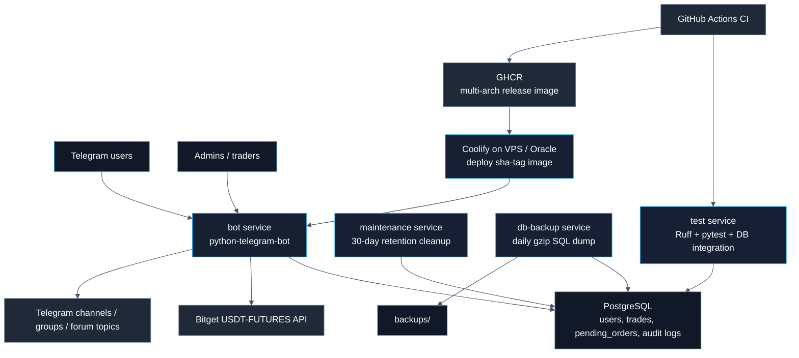
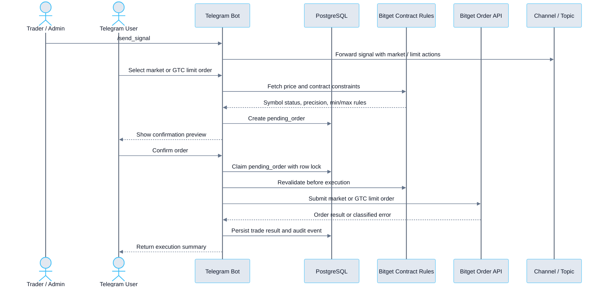
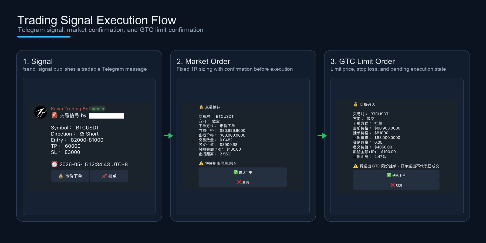
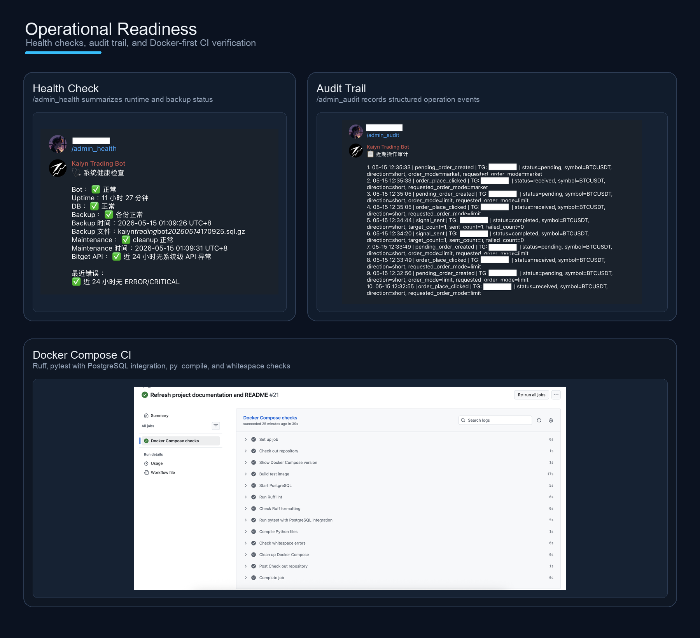

# Kaiyn Trading Bot

[](https://github.com/kylekkkk61/kaiyn-trading-bot/actions/workflows/ci.yml)
[](./LICENSE)
[](https://docs.astral.sh/uv/)
[](./compose.yml)

[](./pyproject.toml)
[](./compose.yml)
[](https://python-telegram-bot.org/)
[](https://www.sqlalchemy.org/)
[](https://alembic.sqlalchemy.org/)
[](https://docs.astral.sh/ruff/)
[](https://docs.pytest.org/)
[](./.github/dependabot.yml)

Kaiyn Trading Bot 是整合 Telegram 與 Bitget USDT-FUTURES 的交易信號執行機器人。使用者可透過 Telegram 設定加密 API 憑證、設定固定 1R 風險金額，並從交易信號按鈕送出市價單或 GTC 限價單。

> 風險提醒：本專案會連接真實交易所 API 並送出合約訂單。Bitget API 應只授予交易權限，不授予提幣權限。

## Highlights

- PostgreSQL-backed pending orders with row locking，避免使用者重複點擊造成重複送單。
- Bitget contract-rule validation before execution，送單前檢查交易對狀態、最小下單量、名義價值、精度與單筆上限。
- Market / GTC limit order flow with fixed 1R sizing，支援市價下單與限價掛單確認流程。
- Encrypted API credential storage，使用 Fernet 加密保存 Bitget API Key、Secret Key、Passphrase。
- Admin alerts, health checks, audit trail，提供 `/admin_health`、`/admin_audit`、啟動與異常告警。
- Docker-first deployment with retention and backup，包含 log rotation、DB retention、每日 PostgreSQL 備份。
- CI/CD with Ruff, pytest, PostgreSQL integration tests, GHCR image publishing, Coolify webhook deployment, Dependabot。

## Architecture



## Demo Flow







## Tech Stack

| Area                  | Choice                                                                 |
| --------------------- | ---------------------------------------------------------------------- |
| Runtime               | Python 3.11                                                            |
| Bot framework         | `python-telegram-bot` 22.7                                             |
| Exchange integration  | Bitget USDT-FUTURES REST API via `httpx` 0.28.1                        |
| Database              | PostgreSQL 16 + SQLAlchemy asyncio 2.0.49 + `asyncpg` 0.29.0           |
| Schema migration      | Alembic 1.18.4                                                         |
| Credential security   | `cryptography` Fernet 48.0.0                                           |
| Deployment            | Docker Compose services: `postgres`, `bot`, `maintenance`, `db-backup` |
| Dependency lock       | uv lockfile + `uv sync --locked`                                       |
| Long-term operations  | Docker log rotation, file log rotation, DB retention, daily SQL backup |
| Testing               | pytest 9.0.3 + opt-in PostgreSQL integration tests                     |
| Lint / format         | Ruff 0.15.12                                                           |
| CI                    | GitHub Actions with Docker Compose-first checks                        |
| CD                    | GHCR multi-arch image + Coolify webhook deployment                     |
| Dependency automation | Dependabot weekly updates; GitHub Actions patch/minor auto-merge       |

## Core Capabilities

- Telegram-based Bitget USDT-FUTURES signal execution.
- Encrypted user API credential storage and API connectivity checks.
- Fixed 1R risk sizing with market and GTC limit order modes.
- Persistent pending order confirmation flow backed by PostgreSQL.
- Managed channel/group forwarding with Telegram forum topic support.
- Admin health checks, alerts, audit events, retention cleanup, and backups.
- Docker Compose local/deployment parity with CI-backed verification.

## Portfolio Notes

- Trading state is persisted in PostgreSQL, so pending confirmations survive Bot restarts and duplicate clicks are guarded by row locking.
- Exchange execution is validated against Bitget contract rules before confirmation and again before order submission.
- Operations are part of the product surface: health checks, audit events, retention cleanup, backups, and restore documentation are included.
- CI mirrors the Docker Compose runtime path, including PostgreSQL integration tests instead of relying on host-local services.
- CD publishes multi-arch images to GHCR and deploys production through Coolify after environment approval.

## Quick Start

建立 `.env`：

```bash
cp .env.template .env
```

產生 Fernet 加密金鑰，並填入 `.env` 的 `ENCRYPTION_KEY`：

```bash
make build
make generate-key
```

啟動 PostgreSQL、套用 migration，並啟動 Bot：

```bash
make deploy
```

等效 Docker Compose 展開命令：

```bash
docker compose build
docker compose up -d postgres
docker compose run --rm bot alembic upgrade head
docker compose run --rm bot python -m app.main --check-db
docker compose up -d bot maintenance db-backup
```

完整部署流程見 [deployment_runbook.md](docs/deployment_runbook.md)。

## Configuration

正式環境以 `.env` 注入設定，範例來源為 [.env.template](.env.template)。

| Variable | Purpose |
| -------- | ------- |
| `TELEGRAM_BOT_TOKEN` | Telegram Bot token |
| `TELEGRAM_ADMIN_IDS` | 管理員 Telegram ID 清單 |
| `ENCRYPTION_KEY` | Fernet key，用於加密 Bitget API 憑證 |
| `DATABASE_URL` | PostgreSQL async connection URL |
| `BITGET_API_URL` | Bitget API base URL |
| `RETENTION_DAYS` | DB 累積紀錄與備份保留天數 |
| `ADMIN_ALERT_*` / `BITGET_ALERT_*` | 管理員告警與 Bitget 連續錯誤門檻 |

## Testing & CI

Docker-first 驗證指令：

```bash
make verify
```

等效 Docker Compose 展開命令：

```bash
docker compose build test
docker compose run --rm test uv lock --check
docker compose run --rm test ruff check .
docker compose run --rm test ruff format --check .
docker compose run --rm test python -m pytest
docker compose run --rm test python -m pytest --run-db
```

GitHub Actions 以相同 Docker Compose 流程執行 Ruff、pytest、PostgreSQL integration tests、`py_compile` 與 whitespace 檢查。CI 通過後，release workflow 會發布 multi-arch image 到 GHCR，並在 `production` environment approval 後透過 Coolify webhook 部署到 VPS / Oracle runtime。Dependabot 每週檢查 Python packages 與 GitHub Actions；GitHub Actions patch/minor PR 可在 CI 與 branch protection 通過後自動 squash merge，Python dependency PR 維持人工 review。

更新 Python 依賴時，使用 Dockerized uv 更新 lockfile：

```bash
docker run --rm -v "$PWD:/app" -w /app ghcr.io/astral-sh/uv:python3.11-bookworm-slim uv lock
```

## Operations

- `maintenance` service 每日清理超過 30 天的累積紀錄。
- `db-backup` service 每日產生 gzip SQL 備份並保留 30 天。
- Docker container logs 與 Bot file logs 都配置 rotation。
- `/admin_health` 提供 DB、backup、cleanup、Bitget API 與近期錯誤狀態。
- `/admin_audit [limit]` 查詢管理員、發單員與下單關鍵操作摘要。

備份還原驗證見 [backup_restore_runbook.md](docs/backup_restore_runbook.md)。

## Documentation

| Document | Description |
| -------- | ----------- |
| [commands.md](docs/commands.md) | Telegram command reference, signal syntax, topic forwarding, smoke tests |
| [trading_flow.md](docs/trading_flow.md) | Order flow, pending orders, exchange-rule validation, error categories, schema summary |
| [deployment_runbook.md](docs/deployment_runbook.md) | DigitalOcean VPS deployment, update, rollback, troubleshooting |
| [oracle_cloud_arm_runbook.md](docs/oracle_cloud_arm_runbook.md) | Oracle Cloud Ampere A1 Flex ARM64 deployment |
| [coolify_runbook.md](docs/coolify_runbook.md) | Coolify webhook deployment with GHCR image pipeline |
| [backup_restore_runbook.md](docs/backup_restore_runbook.md) | PostgreSQL backup restore verification |
| [production_readiness.md](docs/production_readiness.md) | Production readiness design record |
| [deployment_engineering.md](docs/deployment_engineering.md) | CI, Dependabot, lint/format, deployment engineering baseline |

## Project Structure

```text
.
├── app/                    # Telegram bot, Bitget client, order flow, repositories
├── alembic/                # Alembic migration environment and versions
├── tests/                  # pytest unit and PostgreSQL integration tests
├── docs/                   # command, trading, deployment, backup, readiness docs, screenshots
├── compose.yml             # postgres, bot, test, maintenance, db-backup services
├── compose.prod.yml        # image-based production override for GHCR deployments
├── compose.coolify.yml     # complete Coolify Docker Compose application
├── Dockerfile
├── Makefile
├── pyproject.toml
├── uv.lock
└── .env.template
```

## Security Notes

- `.env`、資料庫資料、logs、backups 不提交到 git。
- Runtime logs 採摘要化策略，不輸出 API key、secret、passphrase 或完整交易所 response。
- PostgreSQL 備份包含加密後的 API 憑證與交易紀錄，需以敏感資料保護。
- `ENCRYPTION_KEY` 遺失後，既有加密 API 憑證無法解密。
- Telegram channel/group forwarding 需要 Bot 具備相應管理權限。
