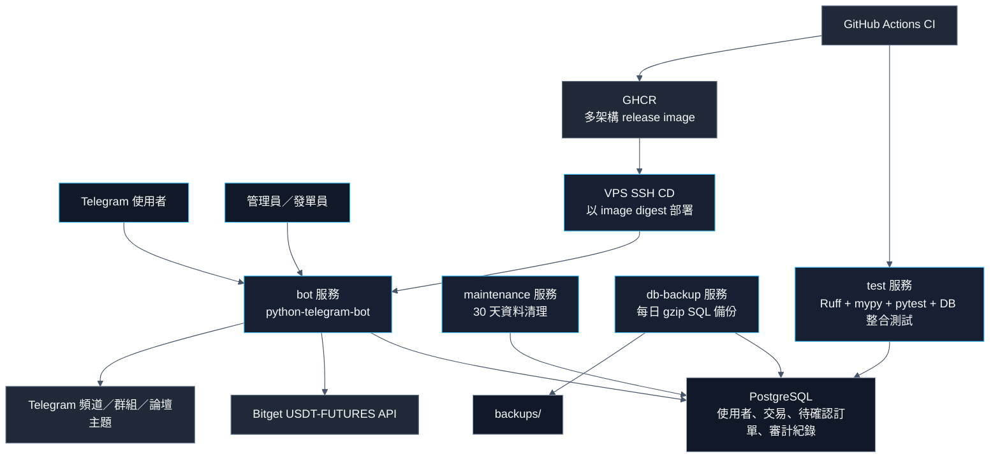
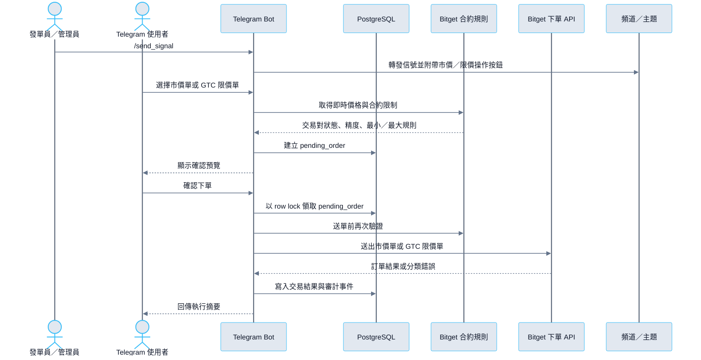

# Kaiyn Trading Bot

[](https://github.com/kaiyn-capital/kaiyn-trading-bot/actions/workflows/ci.yml)
[](./LICENSE)
[](https://docs.astral.sh/uv/)
[](./compose.yml)
[](.github/workflows/release.yml)

[](./pyproject.toml)
[](./compose.yml)
[](https://python-telegram-bot.org/)
[](https://www.sqlalchemy.org/)
[](https://alembic.sqlalchemy.org/)
[](https://docs.astral.sh/ruff/)
[](https://docs.pytest.org/)
[](./.github/dependabot.yml)

> 🌐 [English README](readme.md)

Kaiyn Trading Bot 是整合 Telegram 與 Bitget USDT-FUTURES 的交易信號執行機器人。專案以 production-ready 實務運行規格設計，涵蓋交易確認流程、交易所規則驗證、加密憑證保存、審計紀錄、備份還原與 CI/CD。

使用者可透過 Telegram 設定加密 API 憑證、設定固定 1R 風險金額，並從交易信號按鈕送出市價單或 GTC 限價單。

> **風險提醒：** 本專案會連接真實交易所 API 並送出合約訂單。Bitget API 應只授予交易權限，不授予提幣權限。

## 亮點功能

- PostgreSQL 支援的待確認訂單搭配 row locking，避免使用者重複點擊造成重複送單。
- 送單前執行 Bitget 合約規則驗證——檢查交易對狀態、最小下單量、名義價值、精度與單筆上限。
- 市價單／GTC 限價單流程搭配固定 1R 風險計算，支援市價下單與限價掛單確認流程。
- 使用 Fernet 加密保存 Bitget API Key、Secret Key、Passphrase。
- 管理員告警、健康檢查與審計紀錄——提供 `/admin_health`、`/admin_audit`、啟動通知與異常告警。
- Docker-first 部署搭配資料保留與備份，包含 log rotation、DB 資料清理、每日 PostgreSQL 備份。
- CI/CD 涵蓋 Ruff、mypy、Alembic 檢查、pytest、PostgreSQL 整合測試、GHCR image 發布、VPS SSH 部署與 Dependabot。

## 架構



## 示範流程




## 技術堆疊

| 類別 | 選用 |
| --- | --- |
| 執行環境 | Python 3.11 |
| Bot 框架 | `python-telegram-bot` 22.7 |
| 交易所整合 | Bitget USDT-FUTURES REST API，透過 `httpx` 0.28.1 |
| 資料庫 | PostgreSQL 16 + SQLAlchemy asyncio 2.0.49 + `asyncpg` 0.31.0 |
| Schema 遷移 | Alembic 1.18.4 |
| 憑證安全 | `cryptography` Fernet 48.0.0 |
| 部署方式 | Docker Compose 服務：`postgres`、`bot`、`maintenance`、`db-backup` |
| 依賴鎖定 | uv lockfile + `uv sync --locked` |
| 長期運維 | Docker log rotation、檔案 log rotation、DB 資料保留、每日 SQL 備份 |
| 測試 | pytest 9.0.3 + 可選 PostgreSQL 整合測試 |
| Lint／格式化 | Ruff 0.15.14 |
| 型別檢查 | mypy 1.16.0，針對 critical path modules |
| CI | GitHub Actions 搭配 Docker Compose-first 檢查 |
| CD | GHCR 多架構 image + VPS SSH 以 digest 部署 |
| 依賴自動化 | Dependabot 每週更新；GitHub Actions patch/minor 自動合併 |

## 核心功能

- 基於 Telegram 的 Bitget USDT-FUTURES 交易信號執行。
- 加密使用者 API 憑證儲存與 API 連線檢查。
- 固定 1R 風險計算，支援市價單與 GTC 限價單模式。
- 以 PostgreSQL 為後端的待確認訂單與 Telegram 預覽／session 流程。
- 管理頻道／群組轉發，支援 Telegram 論壇主題。
- 管理員健康檢查、告警、審計事件、資料清理與備份。
- Docker Compose 本地／部署一致性，搭配 CI 驗證。

## 工程備註

- 交易狀態與 Telegram 對話 session 儲存於 PostgreSQL，待確認訂單與有效 TTL 內的預覽在 Bot 重啟後仍然有效。
- 交易所執行在確認前與送單前各驗證一次 Bitget 合約規則。
- 運維是產品功能的一部分：健康檢查、審計事件、資料清理、備份與還原文件均已內建。
- CI 使用與正式環境相同的 Docker Compose 流程，包含 lockfile、migration/model、型別與 PostgreSQL 整合測試，不依賴本機服務。
- CD 發布多架構 image 到 GHCR，並在 environment approval 後透過 SSH 部署到 VPS。

## 快速開始

建立 `.env`：

```bash
cp .env.template .env
```

產生 Fernet 加密金鑰，並填入 `.env` 的 `ENCRYPTION_KEY`：

```bash
make build
make generate-key
```

啟動 PostgreSQL、套用 migration，並啟動 Bot：

```bash
make deploy
```

等效 Docker Compose 展開命令：

```bash
docker compose build
docker compose up -d postgres
docker compose run --rm bot alembic upgrade head
docker compose run --rm bot python -m app.main --check-db
docker compose up -d bot maintenance db-backup
```

完整 DigitalOcean 部署流程見 [deployment_runbook.md](references/deployment_runbook.md)；Coolify 可選部署方案見 [coolify_runbook.md](references/coolify_runbook.md)。

## 設定

正式環境以 `.env` 注入設定，範例來源為 [.env.template](.env.template)。

| 變數 | 用途 |
| --- | --- |
| `TELEGRAM_BOT_TOKEN` | Telegram Bot token |
| `TELEGRAM_ADMIN_IDS` | 管理員 Telegram ID 清單（逗號分隔） |
| `ENCRYPTION_KEY` | Fernet 金鑰，用於加密 Bitget API 憑證 |
| `DATABASE_URL` | PostgreSQL 非同步連線 URL |
| `BITGET_API_URL` | Bitget API 基礎 URL |
| `SIGNAL_CHART_*` | `/send_signal` 附圖功能開關、K 線週期、K 線數量與 timeout |
| `RETENTION_DAYS` | 累積紀錄與備份保留天數 |
| `BACKUP_LOCAL_KEEP_COUNT` | 本機保留最近幾份 SQL 備份 |
| `R2_*` / `BACKUP_ENCRYPTION_KEY` | 可選 Cloudflare R2 加密異地備份設定 |
| `ADMIN_ALERT_*` / `BITGET_ALERT_*` | 管理員告警與 Bitget 連續錯誤門檻 |

## 測試與 CI

Docker-first 驗證指令：

```bash
make verify
```

等效 Docker Compose 展開命令：

```bash
docker compose build test
docker compose run --rm test uv lock --check
docker compose up -d postgres
docker compose run --rm test alembic upgrade head
docker compose run --rm test alembic check
docker compose run --rm test ruff check .
docker compose run --rm test ruff format --check .
docker compose run --rm test mypy app/order_flow.py app/order_validation.py app/risk_limits.py app/bitget_errors.py app/config.py --no-error-summary
docker compose run --rm test python -m pytest --run-db
docker compose run --rm test python -m py_compile app/*.py app/repositories/*.py alembic/env.py alembic/versions/*.py scripts/*.py tests/*.py
git diff --check
```

GitHub Actions 以相同 Docker Compose 流程執行 lockfile 一致性、Alembic migration/model 檢查、Ruff、mypy、PostgreSQL 整合測試與 coverage output、`py_compile` 與空白字元檢查。CI 通過後，release workflow 會發布多架構 image 到 GHCR，並在 `production` environment approval 後透過 SSH 部署 image digest 到 VPS。Coolify 文件保留為可選部署方案。

Dependabot 每週檢查 Python packages 與 GitHub Actions。GitHub Actions patch/minor PR 可在 CI 與 branch protection 通過後自動 squash merge；Python dependency PR 維持人工 review。

更新 Python 依賴 lockfile 時，使用 Dockerized uv：

```bash
docker run --rm -v "$PWD:/app" -w /app ghcr.io/astral-sh/uv:python3.11-bookworm-slim uv lock
```

## 運維

- `maintenance` 服務每日清理超過 30 天的累積紀錄。
- `db-backup` 服務產生 gzip SQL 備份，並附 checksum 與 manifest。
- 高風險操作前可執行 `make backup-now`，需要還原時使用 `make restore-latest` 還原最新本機備份。
- 設定 Cloudflare R2 後，`db-backup` 會把加密備份上傳到異地，`make disaster-restore` 會先下載最新 R2 備份再還原。
- Docker container logs 與 Bot file logs 都配置 rotation。
- `/admin_health` 提供 DB、backup、cleanup、Bitget API 與近期錯誤狀態。
- `/admin_audit [limit]` 查詢管理員、發單員與下單關鍵操作摘要。

備份還原驗證見 [backup_restore_runbook.md](references/backup_restore_runbook.md)。

## 文件

| 文件 | 說明 |
| --- | --- |
| [commands.md](references/commands.md) | Telegram 指令參考、信號語法、主題轉發、冒煙測試 |
| [trading_flow.md](references/trading_flow.md) | 下單流程、待確認訂單、交易所規則驗證、錯誤分類、schema 摘要 |
| [deployment_runbook.md](references/deployment_runbook.md) | DigitalOcean VPS 部署、更新、回滾、故障排除 |
| [coolify_runbook.md](references/coolify_runbook.md) | 可選 Coolify 部署方案搭配 GHCR image pipeline |
| [backup_restore_runbook.md](references/backup_restore_runbook.md) | PostgreSQL 備份還原驗證 |
| [production_readiness.md](references/production_readiness.md) | Production readiness 設計紀錄 |
| [deployment_engineering.md](references/deployment_engineering.md) | CI、Dependabot、lint/format、部署工程基線 |

## 專案結構

```text
.
├── app/                    # Telegram bot、Bitget client、下單流程、repositories
├── alembic/                # Alembic migration 環境與版本
├── tests/                  # pytest 單元測試與 PostgreSQL 整合測試
├── docs/                   # GitHub Pages 網站 (index.html, CNAME, assets)
├── references/             # 指令、交易、部署、備份、readiness 文件
├── compose.yml             # postgres、bot、test、maintenance、db-backup 服務
├── compose.prod.yml        # GHCR 部署用的 image-based production override
├── compose.coolify.yml     # 可選 Coolify Docker Compose 應用
├── Dockerfile
├── Makefile
├── pyproject.toml
├── uv.lock
└── .env.template
```

## 安全注意事項

- `.env`、資料庫資料、logs、backups 不提交到 Git。
- Runtime logs 採摘要化策略，不輸出 API key、secret、passphrase 或完整交易所 response。
- PostgreSQL 備份包含加密後的 API 憑證與交易紀錄，需以敏感資料保護。
- `ENCRYPTION_KEY` 遺失後，既有加密 API 憑證無法解密。
- Telegram 頻道／群組轉發需要 Bot 具備相應管理權限。
